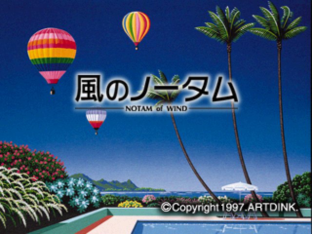

# Kaze no Notam

A matching decompilation of Kaze no Notam (Artdink, 1997, PlayStation,
SLPS-00912).

All 648 game functions build from C. The rebuilt executable is byte for byte
identical to the original, sha1 `f8f44c2ddaf4969f4132fb17d1abab06a75c2def`. The
rest of the binary is PsyQ SDK code, assembled from disassembly.

This repository contains no game data. You need your own copy of the disc.

<!-- decomp-progress-start -->
## Decompilation progress

 

`████████████████████████████████████████` **100.0000%** of game text bytes matched

| Metric | Matched | Total | Progress |
| --- | ---: | ---: | ---: |
| Functions | 648 | 648 | 100.0000% |
| Text bytes | 344,020 | 344,020 | 100.0000% |

Every function is reconstructed readable C that compiles with the original
toolchain and passes an isolated byte comparison. The remaining text in the
binary is PsyQ SDK library code, assembled from disassembly, and is not counted
as game code.
<!-- decomp-progress-end -->

## The game

Kaze no Notam is a hot-air balloon game. You control your height. You do not
control your heading. The wind decides where you actually go.

The sky is divided into five altitude layers, and each one blows its own
direction at its own speed. Getting anywhere means reading them, climbing or
sinking into the layer that drifts you where you want to go, and spending gas to
stay there. Gas drains the whole time, and holding height over high ground costs
more of it, so the direct-looking route is often the one that strands you.

A flight begins on a map where you choose a launch point, and ends when you have
reached the markers or run out of gas.

## Setup

You need `binutils-mipsel-linux-gnu`, Python 3.9 or newer, and a dump of your
own disc.

    git clone --recurse-submodules <url>
    cd kaze-no-notam-decomp
    make setup DISC=/path/to/your/kaze.cue
    make

Cloning without `--recurse-submodules` leaves `tools/asm-differ` and
`tools/maspsx` empty, and the build fails in a confusing way. If you already
cloned without it, run `git submodule update --init` before anything else.

`configure.py` pulls `SLPS_009.12` out of the disc image, checks its sha1, and
fetches the 1997 compiler. `build.sh` compiles every matched function, links,
and verifies the result against your own dump. A successful build ends with:

    PAYLOAD OK (byte-identical)
    EXE OK (byte-identical): f8f44c2ddaf4969f4132fb17d1abab06a75c2def

## What is here

| Path | Contents |
| --- | --- |
| `src/` | the matched C, 169 files |
| `include/` | shared types, GTE macros, the live-root reference struct |
| `config/` | the function ledger, symbol names, switch tables |
| `docs/` | architecture guide, compiler notes, function map |
| `tools/` | build, verification and analysis tools |

Start with `docs/architecture.md`. It walks the game subsystem by subsystem:
the main loop, the flight model, menus, objectives, the renderer, collision,
CD streaming, sound, and demo playback.

## Verifying

    make progress     # matched function and byte counts
    make check        # progress plus the strict review board
    ./diff.py <function>   # instruction-level diff against the original

To check a single function after editing it:

    python3 tools/match.py src/<file>.c <function> --opt=-O2 --compiler=2.7.2-psx

Use the flags recorded for that function in `config/matched.json`. This works
for functions in shared multi-function files as well as standalone ones.

## How it was built

The compiler is PSX-patched GNU C 2.7.2, with a handful of functions built by
2.6.3, at `-mips1 -G0`. Per-function optimisation flags are recorded in
`config/matched.json`. cc1 output goes through maspsx and then
`mipsel-linux-gnu-as`. `docs/compiler-notes.md` records how the compiler was
identified.

## Editing

Any change under `src/` must end with a byte-identical `make`. Renaming
locals, editing comments and moving code between files are all safe. Almost
anything else can silently break a match, so verify.

Declared types of globals sometimes differ between usage sites on purpose. The
original was compiled per translation unit with local declarations, so a
`short` against `u16` mismatch is often load-bearing. Do not "fix" one without
rechecking the bytes.

## Legal

This repository contains no game binary, no disc image and no extracted
assets, apart from one low-resolution title screenshot (`docs/kaze-title-screen.png`)
included to identify the game. It holds original C source, build tooling,
symbol names and documentation produced by reverse engineering.

Kaze no Notam is the property of Artdink. No ownership of their work is
claimed, and no license is granted over the contents of this repository,
because the matched source is derived from their binary. This exists for
preservation and study.

You must supply your own copy of the game. Nothing here will work without it.
